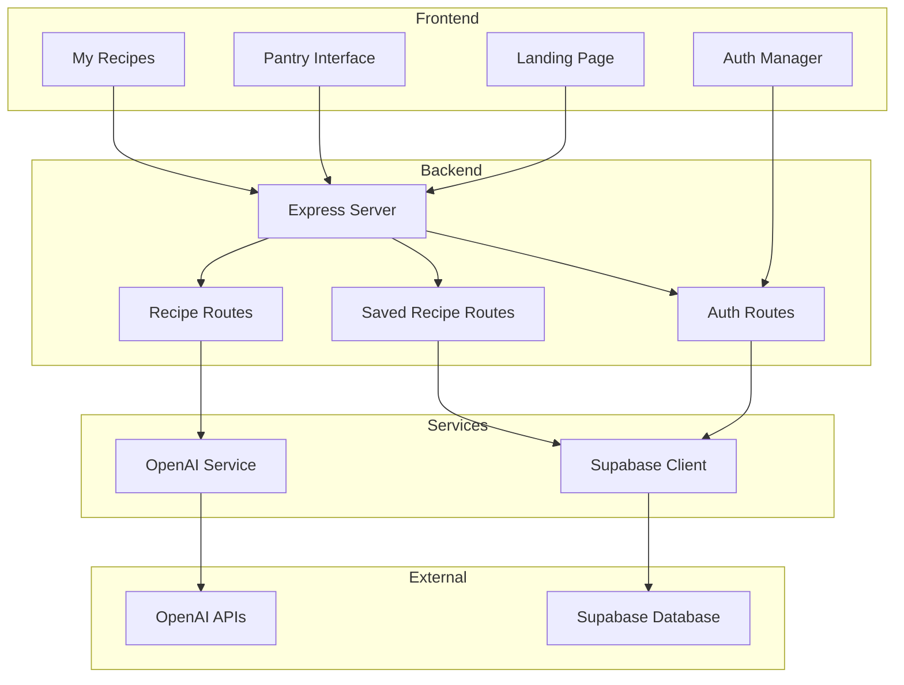

# System Architecture Document
## Recipe Finder - AI-Powered Recipe Generation Platform

### 1. Architecture Overview

The Recipe Finder platform follows a **client-server architecture** with AI integration, designed for scalability, maintainability, and cost optimization.

### 2. System Components

#### 2.1 Frontend Layer
```
┌─────────────────────────────────────┐
│           Frontend (Client)         │
├─────────────────────────────────────┤
│ • Landing Page (index.html)         │
│ • Pantry Interface (pantry.html)    │
│ • My Recipes (my-recipes.html)      │
│ • Authentication Modals             │
│ • Vanilla JavaScript Modules        │
│   - auth.js (Authentication)        │
│   - app.js (Main Application)       │
│   - api.js (API Communication)      │
│   - savedRecipes.js (Recipe Mgmt)   │
│   - landing.js (Landing Page)       │
│   - myRecipes.js (My Recipes)       │
└─────────────────────────────────────┘
```

#### 2.2 Backend Layer
```
┌─────────────────────────────────────┐
│         Backend (Node.js/Express)   │
├─────────────────────────────────────┤
│ • RESTful API Server                │
│ • Authentication Middleware         │
│ • Route Handlers                    │
│   - /api/auth (User Auth)           │
│   - /api/recipes (Recipe Gen)       │
│   - /api/saved-recipes (User Data)  │
│   - /api/images (Image Analysis)    │
│ • Services                          │
│   - openaiService.js                │
│   - supabaseClient.js               │
│ • Middleware                        │
│   - errorMiddleware.js              │
│   - authentication.js               │
└─────────────────────────────────────┘
```

#### 2.3 Data Layer
```
┌─────────────────────────────────────┐
│           Data Storage              │
├─────────────────────────────────────┤
│ • Supabase (Primary Database)       │
│   - users (User Accounts)           │
│   - saved_recipes (User Favorites)  │
│   - recipe_cache (AI Cache)         │
│ • SQLite (Local Development)        │
│   - search_history                  │
│   - favorites                       │
│   - ratings                         │
└─────────────────────────────────────┘
```

#### 2.4 External Services
```
┌─────────────────────────────────────┐
│        External AI Services         │
├─────────────────────────────────────┤
│ • OpenAI GPT-4o-mini                │
│   - Recipe Generation               │
│   - Text Processing                 │
│ • OpenAI DALL-E 3                   │
│   - Recipe Image Generation         │
│ • OpenAI GPT-4o Vision              │
│   - Ingredient Image Analysis       │
└─────────────────────────────────────┘
```

### 3. Data Flow Architecture

#### 3.1 Recipe Generation Flow
```
User Input → Frontend → Backend → OpenAI API → Recipe Cache → Response
     ↓           ↓         ↓          ↓           ↓           ↓
Ingredients → Validation → AI Call → Generation → Storage → Display
```

#### 3.2 Authentication Flow
```
User Credentials → Frontend → Backend → Supabase → JWT Token → Session
       ↓              ↓         ↓         ↓          ↓          ↓
   Login/Signup → Validation → Auth API → Database → Token → Storage
```

#### 3.3 Recipe Saving Flow
```
Recipe Selection → Frontend → Backend → Supabase → User Database → Confirmation
       ↓              ↓         ↓         ↓           ↓             ↓
   Save Button → API Call → Validation → Storage → saved_recipes → Success
```

### 4. Component Relationships



### 5. Security Architecture

#### 5.1 Authentication & Authorization
- **JWT Tokens:** Stateless authentication with configurable expiration
- **Password Hashing:** bcrypt with salt rounds
- **Row Level Security:** Supabase RLS policies for data isolation
- **CORS Protection:** Configured for specific origins

#### 5.2 Input Validation
- **Frontend Validation:** Client-side input sanitization
- **Backend Validation:** Server-side validation and sanitization
- **API Rate Limiting:** Prevent abuse and control costs

#### 5.3 Data Protection
- **Environment Variables:** Sensitive data in .env files
- **HTTPS Enforcement:** Secure data transmission
- **XSS Protection:** Input sanitization and CSP headers

### 6. Performance Architecture

#### 6.1 Caching Strategy
- **Recipe Cache:** Store generated recipes in Supabase
- **Access Tracking:** Monitor cache hit rates and popular combinations
- **Cache Invalidation:** TTL-based cache management

#### 6.2 Optimization Techniques
- **Image Optimization:** Compress and resize recipe images
- **Lazy Loading:** Load recipe images on demand
- **Pagination:** Limit data transfer for large datasets

### 7. Scalability Considerations

#### 7.1 Horizontal Scaling
- **Stateless Backend:** No server-side session storage
- **Database Scaling:** Supabase auto-scaling capabilities
- **Load Balancing:** Ready for multiple server instances

#### 7.2 Cost Optimization
- **Aggressive Caching:** Minimize OpenAI API calls
- **Efficient Queries:** Optimized database queries
- **Resource Monitoring:** Track API usage and costs

### 8. Deployment Architecture

#### 8.1 Development Environment
```
Local Development → Git Repository → Feature Branches → Testing
```

#### 8.2 Production Considerations
- **Environment Separation:** Dev, staging, production configs
- **Database Migrations:** Version-controlled schema changes
- **Monitoring:** Error tracking and performance monitoring
- **Backup Strategy:** Regular database backups

### 9. Technology Stack

#### 9.1 Frontend
- **HTML5/CSS3:** Semantic markup and responsive design
- **Vanilla JavaScript:** No framework dependencies
- **CSS Animations:** Smooth user interactions
- **Local Storage:** Client-side data persistence

#### 9.2 Backend
- **Node.js:** JavaScript runtime
- **Express.js:** Web framework
- **JWT:** Authentication tokens
- **bcrypt:** Password hashing

#### 9.3 Database
- **Supabase:** PostgreSQL with real-time features
- **SQLite:** Local development database

#### 9.4 External Services
- **OpenAI API:** AI-powered recipe generation
- **Supabase Auth:** User authentication service

### 10. Error Handling Architecture

#### 10.1 Error Categories
- **Client Errors:** 4xx status codes with user-friendly messages
- **Server Errors:** 5xx status codes with logging
- **AI Service Errors:** Fallback mechanisms and retry logic

#### 10.2 Error Recovery
- **Graceful Degradation:** Fallback to cached recipes
- **User Feedback:** Clear error messages and recovery suggestions
- **Logging:** Comprehensive error tracking for debugging
